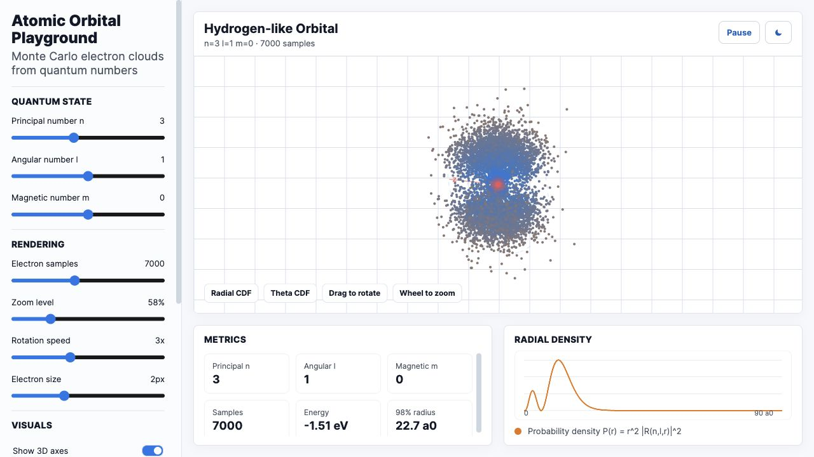

# Atomic Orbital Playground

Standalone browser simulation for exploring atomic orbital-style motion, shells, nucleus behavior, and electron traces.

## Live Demo

[Open the Vercel deployment](https://atom-phi-rose.vercel.app)



## Features

- Interactive electron/orbital visualization on a canvas.
- Adjustable simulation controls and live metrics.
- Light/dark visual system shared with the other playgrounds.
- Single-file static app, deployable without a backend.

## Run Locally

```bash
python3 -m http.server 8774
```

Then open:

```text
http://localhost:8774
```

## Project Structure

```text
index.html       Full standalone simulator
docs/            README screenshot assets
```
